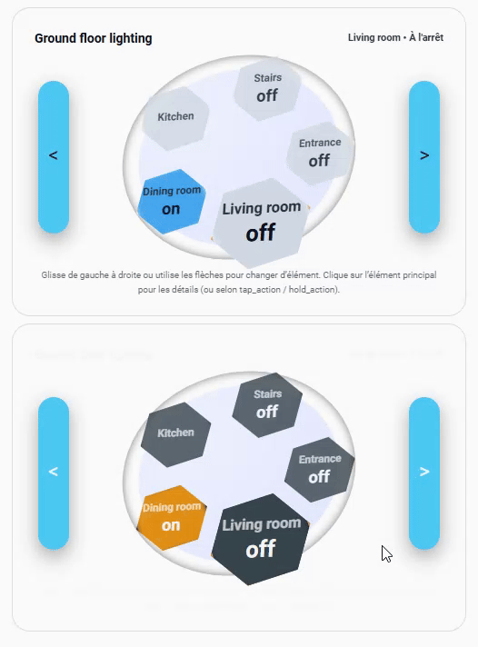

# Raptor Orbit Card


Custom Lovelace card for Home Assistant that displays up to **8 entities** as “bubbles” orbiting around a central disc.

- Works great for **climate**, **covers**, **switches/lights**, **sensors** and **gauges**.
- One big “primary” bubble in front, other entities orbit around.
- Swipe on the wheel or use arrows to switch entity.
- Tap / hold actions are fully configurable.
- Built-in **auto theme** support (light / dark / HA) with different colors per mode.

> **Version:** 1.1.6  
> **Author:** Inter-Raptor (Vivien Jardot)  
> **Card type:** `custom:raptor-orbit-card`

---

## 1. Installation

You can install the card **manually** or via **HACS (custom repository)**.

### 1.1. Manual installation

1. Download the compiled JS file from your repository releases, e.g.:

   - `raptor-orbit-card.js` (or similar bundle name)

2. Copy it into your Home Assistant `www` folder:

   ```text
   /config/www/raptor-orbit-card.js
   ```

3. Add the resource in Home Assistant:

   - Go to **Settings → Dashboards → (top right) … → Resources**  
   - Click **Add resource**:
     - URL: `/local/raptor-orbit-card.js`
     - Type: `JavaScript Module`

4. Restart the browser / clear cache if needed.

Now the card type is available as:

```yaml
type: custom:raptor-orbit-card
```

---

### 1.2. HACS (Custom repository)

If you use HACS, you can add this repository as a **custom repository**:

1. In HACS, go to **Frontend → (top right) … → Custom repositories**
2. Add your GitHub repo URL, for example:

   ```text
   https://github.com/Inter-Raptor/raptor-orbit-card
   ```

3. Category: **Lovelace**

4. Install **Raptor Orbit Card** from HACS, then reload resources / Home Assistant UI if needed.

---

## 2. Basic usage

Minimal example with a climate, a cover, a switch and a temperature sensor:

```yaml
type: custom:raptor-orbit-card
title: Ground Floor Heating
entities:
  - entity: climate.thermostat_rdc
  - entity: cover.volet_salon
  - entity: switch.prise_radiateur
  - entity: sensor.temperature_salon
```

- The first entity is used as **primary** by default.
- You can swipe horizontally on the wheel or use the side arrows to switch entity.

---

## 3. Global configuration options

These options are defined at the **root** of the card configuration.

```yaml
type: custom:raptor-orbit-card
title: "My Orbit Card"
theme_mode: auto
# ...
entities:
  - entity: ...
```

### 3.1. Layout & header

- `title: "Text"`  
  Card title in the header (top left).

- `show_title: true | false` (default: `true`)  
  Show or hide the title.

- `show_status: true | false` (default: `true`)  
  Show the **status line** in the header (top right), e.g.  
  `Thermostat • Heating`, `Socket • Active`.

- `compact: true | false` (default: `false`)  
  Slightly reduces the card height (smaller wheel).

- `transparent: true | false` (default: `false`)  
  If `true`, removes card background and shadow (useful over a custom background image).

- `card_inner_padding: number` (default: `10`)  
  Inner padding of the content (px).

- `tilt: true | false` (default: `true`)  
  - `true`: disc is slightly tilted (3D effect).  
  - `false`: disc is flat (no rotation).

---

### 3.2. Navigation & selection

- `show_arrows: true | false` (default: `true`)  
  Show / hide left and right “wings” used to change entity.

- `invert_swipe: true | false` (default: `false`)  
  Invert swipe direction.

- `primary_entity: entity_id`  
  Entity to be used as “home position” when auto-centering (see below).  
  If not set, the first entity is used.

- `auto_center_timeout: number` (seconds, default: `0`)  
  - `0` or absent: no auto-center.  
  - `> 0`: after this number of seconds without interaction, the card will recenter on `primary_entity`.

- `main_scale: number` (default: `1.1`)  
  Scaling factor applied to the **active** bubble (center front).

- `invert_temps: true | false` (default: `false`)  
  For **climate** entities:
  - `false`: big value = target temp, small value = current temp.
  - `true`: big value = current temp, small value = target.

---

### 3.3. Theme & high-level colors

The card has its own internal theme logic with 2 base modes: **light** and **dark**.  
You can control it via `theme_mode`.

- `theme_mode: auto | light | dark | ha | custom` (default: `auto`)

  - `auto`: follows Home Assistant’s dark mode (`hass.themes.darkMode`).
  - `light`: force light theme for this card.
  - `dark`: force dark theme for this card.
  - `ha`: same as `auto` (linked to HA dark mode).
  - `custom`: like light/dark, but allows overriding CSS vars:
    - `--raptor-card-bg`
    - `--raptor-wheel-bg`
    - `--raptor-slot-bg`
    - `--raptor-slot-shadow`
    - etc.

High-level logical colors:

- `color_on: "#hex"` (default:  
  - Dark theme: orange (`#ff9800`)  
  - Light theme: blue (`#2196f3`))

- `color_off: "#hex"` (default:  
  - Dark theme: dark grey (`#37474f`)  
  - Light theme: soft grey/blue (`#d0d9e6`))

Disc & navigation:

- `disc_color: "#hex"`  
  Base disc color.

- `disc_color_dark: "#hex"`  
  Darker outer disc color.

- `nav_color: "#hex"`  
  Color for navigation “wings”. If omitted, a theme-appropriate color is used.

Gauge & covers:

- `gauge_default_color: "#hex"`  
  Default color for **gauge** and **sensor** fill (when no per-entity color or severities).

- `gauge_direction: "bottom_to_top" | "top_to_bottom" | "left_to_right" | "right_to_left"`  
  Default filling direction for gauges / numeric sensors / covers.

- `cover_fill_color: "#hex"`  
  Default fill color for **covers** (if not overridden per entity).  
  If missing, the card uses theme defaults (blue in light, orange in dark).

---

### 3.4. Climate color palette (global)

For climate entities, the card automatically detects the current phase:

- `hvac_action: heating | cooling | idle`

You can globally override colors for each phase:

- `climate_color_heat: "#hex"`  
  Used when `hvac_action == "heating"`.

- `climate_color_cool: "#hex"`  
  Used when `hvac_action == "cool"`.

- `climate_color_idle: "#hex"`  
  Used when climate is idle / off.

*(Defaults depend on theme: blue/grey in light, orange/grey in dark.)*

---

### 3.5. Binary palette (global)

For binary entities: `switch`, `light`, `input_boolean` (or `mode: binary`):

- `switch_color_on: "#hex"`  
  ON fill color.

- `switch_color_off: "#hex"`  
  OFF fill color.

If not set, the card uses `color_on` / `color_off`.

---

### 3.6. Global text & font settings

- `text_color: "#hex"`  
  Main text color in slots (labels / primary values).

- `text_color_secondary: "#hex"`  
  Secondary text color (sub values, hints).

- `font_header: number` (default: `1.05`)  
  Scale factor for header text (title / status).

- `font_label: number` (default: `1.15`)  
  Scale factor for the entity label.

- `font_temp: number` (default: `1.1`)  
  Scale factor for the main numeric value.

- `font_current: number` (default: `1.15`)  
  Scale factor for the secondary value.

- `label_bold: true | false` (default: `true`)  
  If `true`, entity labels are bold.

---

### 3.7. Global bubble / slot style

- `shape: circle | square | hex` (default: `circle`)  
  Default shape for all bubbles.

- `pattern: solid | stripes | dots` (default: `solid`)  
  Default pattern used by the fill overlay.

- `edge_style: liquid | straight` (default: `liquid`)  
  - `liquid`: blurred “liquid” edge for the fill.  
  - `straight`: sharp fill edge.

- `slot_padding: number` (default: `4`)  
  Default inner padding of each bubble (px).

- `slot_radius: number`  
  Default border radius (px) if you want to override default circle/square shapes.

- `slot_border_color_on: "#hex"`  
  Default border color used when entity is logically ON.

- `slot_border_color_off: "#hex"`  
  Default border color when logically OFF.

---

## 4. Per-entity configuration (common options)

Each entity in `entities:` can be a string or an object.  
String is the simplest form:

```yaml
entities:
  - climate.thermostat_rdc
  - cover.volet_salon
```

Object form allows full customization:

```yaml
entities:
  - entity: sensor.temperature_salon
    name: "Living room"
    mode: sensor
    shape: square
    pattern: stripes
    edge_style: liquid
    tap_action: toggle
    hold_action: more-info
    text_color: "#000000"
    text_color_secondary: "#555555"
    padding: 4
    radius: 18
    border_color: "#90a4ae"
    gauge_direction: left_to_right
    min: 0
    max: 40
    severities:
      - from: 0
        to: 10
        color: "#2196f3"
      - from: 10
        to: 20
        color: "#4caf50"
      - from: 20
        to: 40
        color: "#f44336"
    value_map:
      unknown: "?"
```
## 6. Examples

### 6.1 Heating – Whole house


Orbit card showing all climate entities of the house on a single wheel.  
You can quickly swipe between rooms while keeping the main floor thermostat in front.

```yaml
type: custom:raptor-orbit-card
theme_mode: auto
title: Heating – Whole house
primary_entity: climate.thermostat_rdc
auto_center_timeout: 10
invert_swipe: true
main_scale: 1.15
label_bold: true
disc_color: "#e5ecf6"
disc_color_dark: "#cbd5e1"
nav_color: "#64748b"
color_on: "#ff9800"
color_off: "#90a4ae"
entities:
  - entity: climate.thermostat_rdc
    name: Ground floor
    mode: climate
  - entity: climate.thermostat_chambre_gl
    name: Guest room
    mode: climate
  - entity: climate.thermostat_chambre_maxence
    name: Maxence
    mode: climate
  - entity: climate.thermostat_chambre_parents
    name: Parents
    mode: climate
  - entity: climate.thermostat_sdb
    name: Bathroom
    mode: climate
```

---

### 6.2 Ground floor shutters


Square “card” style for covers with striped pattern and custom colors.  
Each shutter shows its position as a fill percentage.

```yaml
type: custom:raptor-orbit-card
theme_mode: light
title: Ground floor shutters
primary_entity: cover.volet_sejour
auto_center_timeout: 10
main_scale: 1.15
shape: square
pattern: stripes
disc_color: "#e8f7fb"
disc_color_dark: "#c4e4f5"
nav_color: "#0284c7"
color_on: "#06b6d4"
color_off: "#64748b"
label_bold: true
entities:
  - entity: cover.volet_cuisine
    name: Kitchen
    mode: cover
  - entity: cover.volet_salon1
    name: Living room 1
    mode: cover
  - entity: cover.volet_salon2
    name: Living room 2
    mode: cover
  - entity: cover.volet_sejour
    name: Dining room
    mode: cover
```

---

### 6.3 Ground floor lighting



Transparent card over a custom background image.  
Hex-shaped bubbles for all binary lights on the ground floor.

```yaml
type: custom:raptor-orbit-card
theme_mode: light
title: Ground floor lighting
transparent: true
primary_entity: light.interrupteur_salon
auto_center_timeout: 10
main_scale: 1.15
shape: hex
disc_color: "#eef2ff"
disc_color_dark: "#e0e7ff"
nav_color: "#38bdf8"
color_on: "#22c55e"
color_off: "#9ca3af"
label_bold: true
entities:
  - entity: light.interrupteur_salon
    name: Living room
    mode: binary
  - entity: light.interrupteur_sejour
    name: Dining room
    mode: binary
  - entity: light.interrupteur_cuisine
    name: Kitchen
    mode: binary
  - entity: light.interrupteur_escalier
    name: Stairs
    mode: binary
  - entity: light.interrupteur_entree
    name: Entrance
    mode: binary
```

---

### 6.4 Energy overview (sensors & gauges)


Mixed sensor view with one big gauge for the instant current and several temperature sensors around it.

```yaml
type: custom:raptor-orbit-card
theme_mode: light
title: Energy overview
primary_entity: sensor.courant_efficase_intantane
auto_center_timeout: 10
main_scale: 1.15
shape: circle
pattern: dots
disc_color: "#dbeafe"
disc_color_dark: "#bfdbfe"
nav_color: "#0ea5e9"
color_on: "#22c55e"
color_off: "#64748b"
label_bold: true
entities:
  - entity: sensor.courant_efficase_intantane
    name: Instant current
    mode: gauge
    gauge_min: 0
    gauge_max: 40
    gauge_direction: left_to_right
    thresholds:
      - value: 10
        color: "#22c55e"
      - value: 25
        color: "#f97316"
      - value: 40
        color: "#ef4444"
  - entity: sensor.thermometre_exterieur_temperature
    name: Outdoor temperature
    mode: sensor
    min: -10
    max: 40
  - entity: sensor.thermometre_rdc_temperature
    name: Ground floor temperature
    mode: sensor
    min: 10
    max: 30
  - entity: sensor.thermometre_chambre_parents_temperature
    name: Parents room
    mode: sensor
    min: 10
    max: 30
  - entity: sensor.thermometre_maxence_temperature
    name: Maxence room
    mode: sensor
    min: 10
    max: 30
  - entity: sensor.thermometre_pc_temperature
    name: PC desk
    mode: sensor
    min: 15
    max: 40
  - entity: sensor.thermometre_sdb_temperature
    name: Bathroom
    mode: sensor
    min: 10
    max: 30
```

---

### 6.5 Mixed demo (sensors + covers + climate)


Showcase of different shapes and patterns on the same card:  
striped sensors, hex covers and a central climate bubble.

```yaml
type: custom:raptor-orbit-card
show_title: false
show_status: false
show_hint: false
show_arrows: true
tilt: false
primary_entity: climate.thermostat_rdc
theme_mode: auto
shape: circle
pattern: solid
edge_style: liquid
entities:
  - entity: sensor.thermometre_rdc_temperature
    name: Température RDC
    mode: sensor
    shape: square
    pattern: stripes
    edge_style: liquid
    min: 0
    max: 40
    gauge_direction: left_to_right
    severities:
      - from: 0
        to: 10
        color: "#2196f3"
      - from: 10
        to: 20
        color: "#4caf50"
      - from: 20
        to: 40
        color: "#ff4336"
  - entity: cover.volet_sejour
    name: Volet séjour
    mode: cover
    shape: hex
    pattern: stripes
    edge_style: straight
    gauge_direction: bottom_to_top
    cover_fill_color: "#fbc02d"
    border_color: "#5d4037"
  - entity: climate.thermostat_rdc
    name: Chauffage RDC
    mode: climate
    shape: circle
  - entity: cover.volet_salon1
    name: Salon 1
    mode: cover
    shape: hex
    pattern: stripes
    edge_style: straight
    gauge_direction: bottom_to_top
    cover_fill_color: "#fbc02d"
    border_color: "#5d4037"
  - entity: cover.volet_salon2
    name: Salon 2
    mode: cover
    shape: hex
    pattern: stripes
    edge_style: straight
    gauge_direction: top_to_bottom
    cover_fill_color: "#fbc02d"
    border_color: "#5d4037"
```

