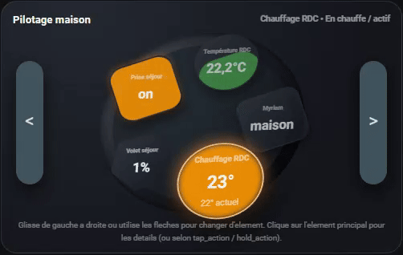
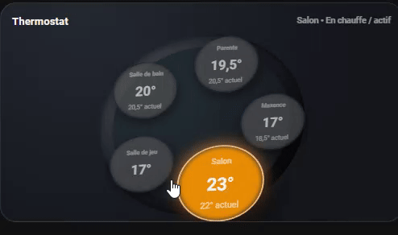
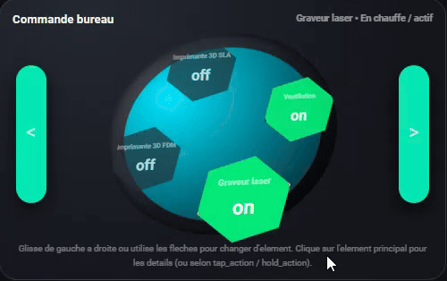

# Raptor Orbit Card


> **Languages / Langues / Idiomas / Sprachen**
>
> - [English](#english)
> - [Français](#français)
> - [Español](#español)
> - [Deutsch](#deutsch)

---

## English

Custom Lovelace card for Home Assistant displaying up to **8 entities**
as bubbles orbiting around a central disc.

- ✅ Supports: `climate`, `cover`, `switch`, `light`, `input_boolean`,
  `sensor`, `gauge`…
- 🌀 Navigation via **swipe** or **left / right arrows**.
- 🖱️ Handles **tap** and **long-press** (toggle, more-info, etc.).
- 🎨 Default theme: black + orange, fully customizable.
- 💿 “Modern dashboard” style: slightly tilted disc, 3D effect, configurable bubbles.
- 🎚 Optional **`tilt`** option: keep the angled disc or use a flat / non-tilted layout.
- 🎛 New **slot styling** options: padding, radius and border color – globally and per entity.
- 🔤 `label_bold` option to render entity names in **bold**.

Author: **Inter-Raptor (Vivien Jardot)**  
Status: **Home beta**

> ℹ️ **Compatibility**  
> All new options (`tilt`, slot styling, etc.) are **optional**.  
> If you don’t change anything in your YAML, the card keeps the same
> behaviour and look as previous versions.

---

## 1) Installation

### 1. Card file

Create a file in Home Assistant:

```text
www/raptor-orbit-card.js
```

Paste the full JavaScript code of the card into this file.

> ⚠️ **Important**  
> Do not forget the comment header `/* ... */` before the ASCII logo in the JS file,  
> otherwise part of the logo will be interpreted as code.

### 2. Lovelace resource

In Home Assistant:

1. Go to **Settings → Dashboards → Resources**
2. Add a resource:
   - **URL**: `/local/raptor-orbit-card.js`
   - **Type**: `JavaScript Module`
3. Save

### 3. Reload the interface

- Either: **Settings → Developer tools → Reload resources**
- Or: clear the browser cache / force reload (`CTRL+F5`)

---

## 2) Basic usage

Minimal configuration (in a Lovelace card):

```yaml
type: custom:raptor-orbit-card
title: Home control
entities:
  - entity: climate.thermostat_rdc
  - entity: cover.volet_sejour
  - entity: switch.interrupteur_sejour
  - entity: sensor.thermometre_rdc_temperature
```

- Maximum **8 entities** per card.
- All options (colors, shapes, etc.) are optional.  
  The card applies **default values** if nothing is specified.

---

## 3) General behavior

- Entities are displayed in **orbit** around a disc.
- First tap on a bubble:
  - If it is **not** the central bubble → that bubble becomes central.
- Tap on the **already central** bubble:
  - Executes `tap_action`  
    (by default: `toggle` for `switch` / `cover`, `more-info` otherwise).
- Long press (**hold**) on a bubble:
  - Executes `hold_action` (by default: `more-info`).

Horizontal swipe (left / right) also changes the active bubble.

---

## 4) Global options

Full example of global options (everything is optional):

```yaml
type: custom:raptor-orbit-card

title: "Home control"
primary_entity: climate.thermostat_rdc

compact: false
transparent: false
show_title: true
show_status: true
show_arrows: true
show_hint: true
invert_swipe: false
invert_temps: false
auto_center_timeout: 0
main_scale: 1.1
tilt: true                  # true = angled disc (default), false = flat

color_on: "#ff9800"
color_off: "#37474f"
disc_color: "#263238"
disc_color_dark: "#111318"
nav_color: "#455a64"

cover_fill_color: "#00bcd4"
gauge_default_color: "#4caf50"
gauge_direction: bottom_to_top

text_color: "#f5f5f5"
text_color_secondary: "rgba(245,245,245,0.78)"

shape: circle          # circle | square | hex
pattern: solid         # solid | stripes | dots
edge_style: liquid     # liquid | straight

# Global slot styling (applies to all bubbles)
slot_padding: 12       # px – inner padding of each bubble slot
slot_radius: 18        # px – corner radius of slots
slot_border_color_on: "#ffffff40"
slot_border_color_off: "#00000040"

font_header: 1
font_label: 1
font_temp: 1
font_current: 1

climate_color_heat: "#ff9800"
climate_color_cool: "#00bcd4"
climate_color_idle: "#37474f"

switch_color_on: "#ff9800"
switch_color_off: "#37474f"

label_bold: true       # render entity names in bold
```

### Quick description of main options

- **`title`** – Text displayed at the top left.  
- **`primary_entity`** – Main entity (target for auto-center).  
- **`compact`** – `true` → smaller card height.  
- **`transparent`** – `true` → remove background and shadow of the `ha-card`.  
- **`show_title` / `show_status`** – Show or hide the title and the status text.  
- **`show_arrows`** – Displays the left / right navigation bars.  
- **`show_hint`** – Displays help text at the bottom of the card.  
- **`invert_swipe`** – Reverse swipe direction (left / right).  
- **`invert_temps`** (for `climate` entities):  
  - `false`: setpoint big, current temperature small.  
  - `true`: current temperature big, setpoint small.  
- **`auto_center_timeout`** – `0` = disabled, `> 0` = seconds before the card auto-centers on `primary_entity`.  
- **`main_scale`** – Zoom factor for the central bubble (`1.1` = 10 % larger).  
- **`tilt`** – `true` keeps the angled / 3D disc, `false` uses a flat disc and slots.  
- **`shape` / `pattern` / `edge_style`** – Default visual style of the bubbles.  
- **`slot_padding`, `slot_radius`** – Global layout of the entity “slots” (inner padding and corner radius).  
- **`slot_border_color_on` / `slot_border_color_off`** – Border color when the entity is on/off.  
- **`label_bold`** – Set all entity names in bold.

---

## 5) Entity configuration

Each entry in `entities:` represents a bubble.

Generic structure:

```yaml
entities:
  - entity: sensor.xxx
    name: Displayed text (optional)
    mode: climate | cover | binary | sensor | gauge
    shape: circle | square | hex
    pattern: solid | stripes | dots
    edge_style: liquid | straight
    tap_action: toggle | more-info
    hold_action: more-info
    text_color: "#ffffff"
    text_color_secondary: "rgba(...)"
    value_map:
      state1: "Text 1"
      state2: "Text 2"
    # Optional per-entity slot styling:
    padding: 12        # overrides global slot_padding
    radius: 18         # overrides global slot_radius
    border_color: "#ffffff40"
```

Automatic detection of `mode` if not defined:

- `climate.xxx` → `mode: climate`  
- `cover.xxx` → `mode: cover`  
- `switch` / `light` / `input_boolean` → `mode: binary`  
- `sensor.xxx` → `mode: sensor`

### 5.1) Climate

```yaml
- entity: climate.thermostat_rdc
  name: Heating – Ground floor
  mode: climate
  heat_color: "#ff9800"
  cool_color: "#00bcd4"
  idle_color: "#37474f"
  tap_action: more-info
  hold_action: more-info
```

The card reads:

- `attributes.current_temperature`
- `attributes.temperature` / `target_temp*`
- `attributes.hvac_action` (`heating`, `cooling`, etc.)

Three phases:

- **heat** → heating color  
- **cool** → cooling color  
- **idle** → neutral color when nothing is heating / cooling

### 5.2) Cover (blinds)

```yaml
- entity: cover.volet_sejour
  name: Living room shutter
  mode: cover
  shape: hex
  pattern: stripes
  edge_style: straight
  cover_fill_color: "#00bcd4"
  gauge_direction: bottom_to_top
  tap_action: toggle
  hold_action: more-info
```

Uses `current_position` or `position` in percent.  
The fill progresses according to this value.  
Default `tap_action`: `toggle` (open / close).

### 5.3) Binary (switch / light / input_boolean)

```yaml
- entity: switch.interrupteur_sejour
  name: Living room plug
  mode: binary
  shape: square
  pattern: solid
  edge_style: straight
  color_on: "#ff9800"
  color_off: "#37474f"
  tap_action: toggle
  hold_action: more-info
```

- **ON** → full fill with `color_on`  
- **OFF** → full fill with `color_off`

### 5.4) Gauge

```yaml
- entity: sensor.courant_efficace_instantane
  name: Instant current
  mode: gauge
  min: 0
  max: 35
  gauge_direction: left_to_right
  shape: circle
  pattern: dots
  edge_style: straight
  gauge_color: "#4caf50"
  severities:
    - from: 0
      to: 10
      color: "#4caf50"
    - from: 10
      to: 20
      color: "#ff9800"
    - from: 20
      to: 35
      color: "#ff4336"
  tap_action: more-info
  hold_action: more-info
```

- `state` value must be **numeric**.  
- `min` and `max` define the scale.  
- `severities` allows changing color according to the value.

### 5.5) Simple sensor

```yaml
- entity: sensor.thermometre_rdc_temperature
  name: Ground floor temperature
  mode: sensor
  min: 10
  max: 30
  severities:
    - from: 0
      to: 18
      color: "#2196f3"
    - from: 18
      to: 23
      color: "#4caf50"
    - from: 23
      to: 40
      color: "#ff4336"
  tap_action: more-info
  hold_action: more-info
```

### 5.6) Person / tracker (with `value_map`)

```yaml
- entity: person.myriam
  name: Myriam
  mode: sensor
  value_map:
    home: "home"
    not_home: "away"
  tap_action: more-info
  hold_action: more-info
```

`value_map` lets you replace the raw state text by a custom label.

---

## 6) Full example

```yaml
type: custom:raptor-orbit-card
title: Home control
primary_entity: climate.thermostat_rdc

color_on: "#ff9800"
color_off: "#37474f"
disc_color: "#263238"
disc_color_dark: "#111318"
nav_color: "#455a64"
shape: circle
pattern: solid
edge_style: liquid
slot_padding: 12
slot_radius: 18

entities:
  - entity: climate.thermostat_rdc
    name: Heating – Ground floor
    mode: climate
    tap_action: more-info
    hold_action: more-info

  - entity: cover.volet_sejour
    name: Living room shutter
    mode: cover
    shape: hex
    pattern: stripes
    edge_style: straight
    tap_action: toggle
    hold_action: more-info

  - entity: switch.interrupteur_sejour
    name: Living room plug
    mode: binary
    shape: square
    tap_action: toggle
    hold_action: more-info

  - entity: sensor.thermometre_rdc_temperature
    name: Ground floor temperature
    mode: sensor
    min: 10
    max: 30
    severities:
      - from: 0
        to: 18
        color: "#2196f3"
      - from: 18
        to: 23
        color: "#4caf50"
      - from: 23
        to: 40
        color: "#ff4336"
    tap_action: more-info
    hold_action: more-info

  - entity: person.myriam
    name: Myriam
    mode: sensor
    value_map:
      home: "home"
    tap_action: more-info
    hold_action: more-info
```

---

## 6. Examples with GIF

### 6.1. Mixed – General control



```yaml
type: custom:raptor-orbit-card
title: Home control
primary_entity: climate.thermostat_rdc
color_on: "#ff9800"
color_off: "#37474f"
disc_color: "#263238"
disc_color_dark: "#111318"
nav_color: "#455a64"
label_bold: true
entities:
  - entity: climate.thermostat_rdc
    name: Heating – Ground floor
    mode: climate
    primary: true
  - entity: sensor.thermometre_rdc_temperature
    name: Ground floor temperature
    mode: sensor
  - entity: cover.volet_sejour
    name: Living room shutter
    mode: cover
  - entity: switch.interrupteur_sejour
    name: Living room plug
    mode: binary
  - entity: person.myriam
    name: Myriam
    mode: sensor
    value_map:
      home: "home"
      not_home: "away"
```

### 6.2. Thermostat – Room group



```yaml
type: custom:raptor-orbit-card
title: Thermostat
primary_entity: climate.thermostat_rdc
invert_swipe: true
label_bold: true
entities:
  - entity: climate.thermostat_rdc
    name: Living room
    mode: climate
    primary: true
  - entity: climate.thermostat_chambre_gl
    name: Playroom
    mode: climate
  - entity: climate.thermostat_sdb
    name: Bathroom
    mode: climate
  - entity: climate.thermostat_chambre_parents
    name: Parents
    mode: climate
  - entity: climate.thermostat_chambre_maxence
    name: Maxence
    mode: climate
```

### 6.3. Switch control – Workshop / Office



```yaml
type: custom:raptor-orbit-card
title: Office control
primary_entity: switch.commande_laser
disc_color: "#00e5ff"
disc_color_dark: "#00171f"
nav_color: "#00ffc3"
color_on: "#00ff7f"
color_off: "#263238"
shape: hex
label_bold: true
entities:
  - entity: switch.commande_laser
    name: Laser engraver
    mode: binary
    primary: true
  - entity: switch.commande_3d_fdm
    name: 3D printer FDM
    mode: binary
  - entity: switch.commande_3d_sla
    name: 3D printer SLA
    mode: binary
  - entity: switch.commande_ventilation
    name: Ventilation
    mode: binary
```

### 6.4. Ground floor shutters


```yaml
type: custom:raptor-orbit-card
title: Ground floor shutters
primary_entity: cover.volet_sejour
disc_color: "#4e342e"
disc_color_dark: "#1b1513"
nav_color: "#fbc02d"
color_on: "#fbc02d"
color_off: "#3e2723"
shape: square
pattern: stripes
label_bold: true
entities:
  - entity: cover.volet_cuisine
    name: Kitchen
    mode: cover
  - entity: cover.volet_salon1
    name: Living room 1
    mode: cover
  - entity: cover.volet_salon2
    name: Living room 2
    mode: cover
  - entity: cover.volet_sejour
    name: Dining room
    mode: cover
    primary: true
```

---

## 7) Limits and notes

- Maximum **8 entities** per card.  
- Some custom entities will be treated as simple `sensor`.  
- If a numeric value cannot be converted to a number, the card simply shows
  the text without a gauge.  
- New styling options (`tilt`, slot padding / radius / border) are fully optional
  and safe to ignore if you prefer the original look.

_End of English section._


## Français
Carte Lovelace personnalisée pour Home Assistant affichant jusqu’à **8 entités**
sous forme de bulles orbitant autour d’un disque central.

- ✅ Supporte : `climate`, `cover`, `switch`, `light`, `input_boolean`,
  `sensor`, `gauge`…
- 🌀 Navigation par **swipe** ou **flèches** gauche / droite.
- 🖱️ Gestion du **tap** et de l’**appui long** (`toggle`, `more-info`, etc.).
- 🎨 Style “dashboard moderne” : disque légèrement oblique, effet 3D, bulles paramétrables.
- 🧩 Installation **HACS** (custom repository) ou manuelle.
- 🔤 Option `label_bold` pour afficher les noms d’entités en **gras**.

Auteur : **Inter-Raptor** (Vivien Jardot)  
Statut : **Bêta maison**

---

## 1. Installation

### 1.1. Via HACS (recommandé)

1. Dans Home Assistant, ouvrir **HACS → Frontend**.
2. Cliquer sur les **⋮ (trois points)** en haut à droite →  
   **Custom repositories**.
3. Ajouter le dépôt :

   - **URL** : `https://github.com/Inter-Raptor/raptor-orbit-card`
   - **Category** : `Frontend`

4. Dans HACS → **Frontend**, trouver **Raptor Orbit Card** et cliquer sur
   **Install**.
5. Redémarrer Home Assistant si nécessaire.

Puis ajouter la ressource (HACS s’en charge normalement tout seul, mais au cas où) :

```yaml
# Paramètres → Tableaux de bord → Ressources
url: /hacsfiles/raptor-orbit-card/raptor-orbit-card.js
type: module
```

---

### 1.2. Installation manuelle

1. Copier `raptor-orbit-card.js` dans :

   ```
   config/www/raptor-orbit-card.js
   ```

2. Ajouter la ressource Lovelace :

   - **Paramètres → Tableaux de bord → Ressources → Ajouter ressource**
   - URL : `/local/raptor-orbit-card.js`
   - Type : `JavaScript Module`

3. Recharger les ressources :

   - soit via **Paramètres → Outils de développement → Recharger les ressources**  
   - soit avec un **CTRL+F5** dans le navigateur.

> ⚠️ Ne pas oublier l’en-tête de commentaire `/* ... */` avant le logo ASCII
> dans le fichier JS, sinon une partie du logo sera interprétée comme du code.

---

## 2. Utilisation de base

Configuration minimale :

```yaml
type: custom:raptor-orbit-card
title: Pilotage maison
entities:
  - entity: climate.thermostat_rdc
  - entity: cover.volet_sejour
  - entity: switch.interrupteur_sejour
  - entity: sensor.thermometre_rdc_temperature
```

- Maximum **8 entités** par carte.
- Toutes les options sont **facultatives** : la carte applique des valeurs
  par défaut si rien n’est précisé.

---

## 3. Comportement général

- Les entités sont affichées en orbite autour d’un disque central.
- **Premier tap** sur une bulle :
  - Si ce n’est pas la bulle centrale → elle devient centrale.
- **Tap** sur la bulle déjà centrale :
  - Exécute `tap_action` (par défaut : `toggle` pour switch/cover,
    `more-info` sinon).
- **Appui long** :
  - Exécute `hold_action` (par défaut : `more-info`).

Le **swipe horizontal** (gauche/droite) permet aussi de changer de bulle active.

---

## 4. Options globales

Exemple complet (tout est optionnel) :

```yaml
type: custom:raptor-orbit-card

title: "Pilotage maison"
primary_entity: climate.thermostat_rdc

compact: false
transparent: false
show_title: true
show_status: true
show_arrows: true
show_hint: true
invert_swipe: false
invert_temps: false
auto_center_timeout: 0      # secondes, 0 = désactivé
main_scale: 1.1             # zoom bulle centrale

color_on: "#ff9800"
color_off: "#37474f"
disc_color: "#263238"
disc_color_dark: "#111318"
nav_color: "#455a64"

cover_fill_color: "#00bcd4"
gauge_default_color: "#4caf50"
gauge_direction: bottom_to_top

text_color: "#f5f5f5"
text_color_secondary: "rgba(245,245,245,0.78)"

shape: circle          # circle | square | hex
pattern: solid         # solid | stripes | dots
edge_style: liquid     # liquid | straight

font_header: 1
font_label: 1
font_temp: 1
font_current: 1

climate_color_heat: "#ff9800"
climate_color_cool: "#00bcd4"
climate_color_idle: "#37474f"

switch_color_on: "#ff9800"
switch_color_off: "#37474f"

label_bold: true       # met les noms d’entités en gras
```

Résumé des principales options :

- **`primary_entity`** : entité principale, utilisée pour le recentrage automatique.
- **`compact`** : `true` → carte plus basse.
- **`transparent`** : `true` → enlève le fond et l’ombre du `ha-card`.
- **`show_title` / `show_status`** : affichage du titre et du texte d’état.
- **`show_arrows`** : affiche les barres de navigation gauche / droite.
- **`show_hint`** : affiche un texte d’aide en bas de la carte.
- **`invert_swipe`** : inverse le sens du swipe.
- **`invert_temps`** (climate) :
  - `false` : consigne en gros, température actuelle en petit.
  - `true` : température actuelle en gros, consigne en petit.
- **`auto_center_timeout`** : délai avant recentrage sur `primary_entity`.
- **`shape` / `pattern` / `edge_style`** : style visuel des bulles.
- **`label_bold`** : met tous les `name` des entités en gras.

---

## 5. Configuration des entités

Chaque entrée dans `entities:` représente une bulle.

```yaml
entities:
  - entity: sensor.xxx
    name: Mon capteur
    mode: climate | cover | binary | sensor | gauge
    shape: circle | square | hex
    pattern: solid | stripes | dots
    edge_style: liquid | straight
    tap_action: more-info
    hold_action: more-info
    text_color: "#ffffff"
    text_color_secondary: "rgba(255,255,255,0.7)"
    value_map:
      home: "maison"
      not_home: "ailleurs"
```

Si `mode` n’est pas défini, la carte devine automatiquement :

- `climate.*` → `mode: climate`
- `cover.*` → `mode: cover`
- `switch.*` / `light.*` / `input_boolean.*` → `mode: binary`
- `sensor.*` → `mode: sensor`

### 5.1. Climate

```yaml
- entity: climate.thermostat_rdc
  name: Chauffage RDC
  mode: climate
  heat_color: "#ff9800"
  cool_color: "#00bcd4"
  idle_color: "#37474f"
  tap_action: more-info
  hold_action: more-info
```

---

### 5.2. Cover (volets)

```yaml
- entity: cover.volet_sejour
  name: Volet séjour
  mode: cover
  shape: hex
  pattern: stripes
  edge_style: straight
  cover_fill_color: "#00bcd4"
  gauge_direction: bottom_to_top
  tap_action: toggle
  hold_action: more-info
```

---

### 5.3. Binaire (switch / light / input_boolean)

```yaml
- entity: switch.interrupteur_sejour
  name: Prise séjour
  mode: binary
  shape: square
  pattern: solid
  edge_style: straight
  color_on: "#ff9800"
  color_off: "#37474f"
  tap_action: toggle
  hold_action: more-info
```

---

### 5.4. Gauge (jauge)

```yaml
- entity: sensor.courant_efficace_instantane
  name: Courant instantané
  mode: gauge
  min: 0
  max: 35
  gauge_direction: left_to_right
  shape: circle
  pattern: dots
  edge_style: straight
  gauge_color: "#4caf50"
  severities:
    - from: 0
      to: 10
      color: "#4caf50"
    - from: 10
      to: 20
      color: "#ff9800"
    - from: 20
      to: 35
      color: "#ff4336"
```

---

### 5.5. Sensor simple

```yaml
- entity: sensor.thermometre_rdc_temperature
  name: Température RDC
  mode: sensor
  min: 10
  max: 30
  severities:
    - from: 0
      to: 18
      color: "#2196f3"
    - from: 18
      to: 23
      color: "#4caf50"
    - from: 23
      to: 40
      color: "#ff4336"
```

---

### 5.6. Person / Tracker avec value_map

```yaml
- entity: person.myriam
  name: Myriam
  mode: sensor
  value_map:
    home: "maison"
    not_home: "ailleurs"
  tap_action: more-info
  hold_action: more-info
```

---

## 6. Exemples avec GIF

### 6.1. Mix – Pilotage général


```yaml
type: custom:raptor-orbit-card
title: Pilotage maison
primary_entity: climate.thermostat_rdc
color_on: "#ff9800"
color_off: "#37474f"
disc_color: "#263238"
disc_color_dark: "#111318"
nav_color: "#455a64"
label_bold: true
entities:
  - entity: climate.thermostat_rdc
    name: Chauffage RDC
    mode: climate
    primary: true
  - entity: sensor.thermometre_rdc_temperature
    name: Température RDC
    mode: sensor
  - entity: cover.volet_sejour
    name: Volet séjour
    mode: cover
  - entity: switch.interrupteur_sejour
    name: Prise séjour
    mode: binary
  - entity: person.myriam
    name: Myriam
    mode: sensor
    value_map:
      home: "maison"
```

---

### 6.2. Thermostat – Groupe de zones


```yaml
type: custom:raptor-orbit-card
title: Thermostat
primary_entity: climate.thermostat_rdc
invert_swipe: true
label_bold: true
entities:
  - entity: climate.thermostat_rdc
    name: Salon
    mode: climate
    primary: true
  - entity: climate.thermostat_chambre_gl
    name: Salle de jeu
    mode: climate
  - entity: climate.thermostat_sdb
    name: Salle de bain
    mode: climate
  - entity: climate.thermostat_chambre_parents
    name: Parents
    mode: climate
  - entity: climate.thermostat_chambre_maxence
    name: Maxence
    mode: climate
```

---

### 6.3. Commande switch – Atelier / bureau


```yaml
type: custom:raptor-orbit-card
title: Commande bureau
primary_entity: switch.commande_laser
disc_color: "#00e5ff"
disc_color_dark: "#00171f"
nav_color: "#00ffc3"
color_on: "#00ff7f"
color_off: "#263238"
shape: hex
label_bold: true
entities:
  - entity: switch.commande_laser
    name: Graveur laser
    mode: binary
    primary: true
  - entity: switch.commande_3d_fdm
    name: Imprimante 3D FDM
    mode: binary
  - entity: switch.commande_3d_sla
    name: Imprimante 3D SLA
    mode: binary
  - entity: switch.commande_ventilation
    name: Ventilation
    mode: binary
```

---

### 6.4. Volets RDC


```yaml
type: custom:raptor-orbit-card
title: Volets RDC
primary_entity: cover.volet_sejour
disc_color: "#4e342e"
disc_color_dark: "#1b1513"
nav_color: "#fbc02d"
color_on: "#fbc02d"
color_off: "#3e2723"
shape: square
pattern: stripes
label_bold: true
entities:
  - entity: cover.volet_cuisine
    name: Cuisine
    mode: cover
  - entity: cover.volet_salon1
    name: Salon 1
    mode: cover
  - entity: cover.volet_salon2
    name: Salon 2
    mode: cover
  - entity: cover.volet_sejour
    name: Séjour
    mode: cover
    primary: true
```

---

## 7. Limites et remarques

- Maximum **8 entités** par carte.
- Certaines entités custom seront traitées comme de simples `sensor`.
- Si une valeur ne peut pas être convertie en nombre, la carte affiche
  simplement le texte sans jauge.
- La carte est encore en **bêta** : n’hésite pas à ouvrir une issue ou proposer
  des idées d’améliorations.

---

Merci d’utiliser **Raptor Orbit Card** 🦖💡


## Español

Tarjeta Lovelace personalizada para Home Assistant que muestra hasta **8 entidades**
como burbujas orbitando alrededor de un disco central.

- ✅ Compatible con: `climate`, `cover`, `switch`, `light`, `input_boolean`,
  `sensor`, `gauge`…
- 🌀 Navegación mediante **deslizamiento (swipe)** o **flechas izquierda / derecha**.
- 🖱️ Gestiona **tap** y **pulsación prolongada** (toggle, more-info, etc.).
- 🎨 Tema por defecto: negro + naranja, totalmente personalizable.
- 💿 Estilo “panel moderno”: disco ligeramente inclinado, efecto 3D, burbujas configurables.

Autor: **Inter-Raptor (Vivien Jardot)**  
Estado: **Home beta**


---

## 1) Instalación

### 1. Archivo de la tarjeta

Crea un archivo en Home Assistant:

```text
www/raptor-orbit-card.js
```

Pega el código JavaScript completo de la tarjeta en este archivo.

> ⚠️ **Importante**  
> No olvides el encabezado de comentario `/* ... */` antes del logo ASCII en el archivo JS,  
> de lo contrario, parte del logo será interpretado como código.


### 2. Recurso Lovelace

En Home Assistant:

1. Ve a **Ajustes → Paneles → Recursos**
2. Añade un recurso:
   - **URL**: `/local/raptor-orbit-card.js`
   - **Tipo**: `JavaScript Module`
3. Guarda


### 3. Recargar la interfaz

- Opción 1: **Ajustes → Herramientas de desarrollo → Recargar recursos**
- Opción 2: borrar la caché del navegador / forzar recarga (`CTRL+F5`)


---

## 2) Uso básico

Configuración mínima (en una tarjeta Lovelace):

```yaml
type: custom:raptor-orbit-card
title: Home control
entities:
  - entity: climate.thermostat_rdc
  - entity: cover.volet_sejour
  - entity: switch.interrupteur_sejour
  - entity: sensor.thermometre_rdc_temperature
```

- Máximo **8 entidades** por tarjeta.
- Todas las opciones (colores, formas, etc.) son opcionales.  
  La tarjeta aplica **valores por defecto** si no se especifica nada.


---

## 3) Comportamiento general

- Las entidades se muestran en **órbita** alrededor de un disco.
- Primer toque sobre una burbuja:
  - Si **no** es la burbuja central → esa burbuja se convierte en central.
- Toque sobre la burbuja **ya central**:
  - Ejecuta `tap_action`  
    (por defecto: `toggle` para `switch` / `cover`, `more-info` en otros casos).
- Pulsación prolongada (**hold**) sobre una burbuja:
  - Ejecuta `hold_action` (por defecto: `more-info`).

El deslizamiento horizontal (izquierda / derecha) también cambia la burbuja activa.


---

## 4) Opciones globales

Ejemplo completo de opciones globales (todo es opcional):

```yaml
type: custom:raptor-orbit-card

title: "Home control"
primary_entity: climate.thermostat_rdc

compact: false
transparent: false
show_title: true
show_status: true
show_arrows: true
show_hint: true
invert_swipe: false
invert_temps: false
auto_center_timeout: 0
main_scale: 1.1

color_on: "#ff9800"
color_off: "#37474f"
disc_color: "#263238"
disc_color_dark: "#111318"
nav_color: "#455a64"

cover_fill_color: "#00bcd4"
gauge_default_color: "#4caf50"
gauge_direction: bottom_to_top

text_color: "#f5f5f5"
text_color_secondary: "rgba(245,245,245,0.78)"

shape: circle          # circle | square | hex
pattern: solid         # solid | stripes | dots
edge_style: liquid     # liquid | straight

font_header: 1
font_label: 1
font_temp: 1
font_current: 1

climate_color_heat: "#ff9800"
climate_color_cool: "#00bcd4"
climate_color_idle: "#37474f"

switch_color_on: "#ff9800"
switch_color_off: "#37474f"
```


### Descripción rápida de las opciones principales

**title**  
Texto mostrado arriba a la izquierda.

**primary_entity**  
Entidad principal (objetivo del auto-centrado).

**compact**  
`true` → tarjeta más baja (altura reducida).

**transparent**  
`true` → elimina el fondo y la sombra de la `ha-card`.

**show_title / show_status**  
Muestran u ocultan el título y el texto de estado arriba a la derecha.

**show_arrows**  
Muestra las barras de navegación izquierda / derecha.

**show_hint**  
Muestra un texto de ayuda en la parte inferior de la tarjeta.

**invert_swipe**  
Invierte la dirección del deslizamiento (izquierda / derecha).

**invert_temps** (para entidades `climate`)  
- `false`: consigna en grande, temperatura actual en pequeño.  
- `true` : temperatura actual en grande, consigna en pequeño.

**auto_center_timeout**  
- `0` = desactivado  
- `> 0`: segundos antes de que la tarjeta se auto-centre en `primary_entity`.

**main_scale**  
Factor de zoom de la burbuja central (`1.1` = 10 % más grande).

**shape**  
Forma por defecto de las burbujas: `circle`, `square`, `hex`.

**pattern**  
Patrón de relleno: `solid`, `stripes`, `dots`.

**edge_style**  
Borde de la zona rellena: `straight` (recto) o `liquid` (suave).


---

## 5) Configuración de entidades

Cada entrada en `entities:` representa una burbuja.

Estructura genérica:

```yaml
entities:
  - entity: sensor.xxx
    name: Texto mostrado (opcional)
    mode: climate | cover | binary | sensor | gauge
    shape: circle | square | hex
    pattern: solid | stripes | dots
    edge_style: liquid | straight
    tap_action: toggle | more-info
    hold_action: more-info
    text_color: "#ffffff"
    text_color_secondary: "rgba(...)"
    value_map:
      state1: "Texto 1"
      state2: "Texto 2"
```

Detección automática de `mode` si no se define:

- `climate.xxx` → `mode: climate`  
- `cover.xxx` → `mode: cover`  
- `switch` / `light` / `input_boolean` → `mode: binary`  
- `sensor.xxx` → `mode: sensor`


### 5.1) Climate

```yaml
- entity: climate.thermostat_rdc
  name: Heating – Ground floor
  mode: climate
  heat_color: "#ff9800"
  cool_color: "#00bcd4"
  idle_color: "#37474f"
  tap_action: more-info
  hold_action: more-info
```

La tarjeta lee:

- `attributes.current_temperature`
- `attributes.temperature` / `target_temp*`
- `attributes.hvac_action` (`heating`, `cooling`, etc.)

Tres fases:

- **heat** → color de calefacción  
- **cool** → color de refrigeración  
- **idle** → color neutro cuando no se está calentando / enfriando


### 5.2) Cover (persianas)

```yaml
- entity: cover.volet_sejour
  name: Living room shutter
  mode: cover
  shape: hex
  pattern: stripes
  edge_style: straight
  cover_fill_color: "#00bcd4"
  gauge_direction: bottom_to_top
  tap_action: toggle
  hold_action: more-info
```

Usa `current_position` o `position` en porcentaje.  
El relleno progresa según este valor.  
`tap_action` por defecto: `toggle` (abrir / cerrar).


### 5.3) Binary (switch / light / input_boolean)

```yaml
- entity: switch.interrupteur_sejour
  name: Living room plug
  mode: binary
  shape: square
  pattern: solid
  edge_style: straight
  color_on: "#ff9800"
  color_off: "#37474f"
  tap_action: toggle
  hold_action: more-info
```

- **ON** → relleno completo con `color_on`  
- **OFF** → relleno completo con `color_off`


### 5.4) Gauge (medidor)

```yaml
- entity: sensor.courant_efficace_instantane
  name: Instant current
  mode: gauge
  min: 0
  max: 35
  gauge_direction: left_to_right
  shape: circle
  pattern: dots
  edge_style: straight
  gauge_color: "#4caf50"
  severities:
    - from: 0
      to: 10
      color: "#4caf50"
    - from: 10
      to: 20
      color: "#ff9800"
    - from: 20
      to: 35
      color: "#ff4336"
  tap_action: more-info
  hold_action: more-info
```

- El valor `state` debe ser **numérico**.  
- `min` y `max` definen la escala.  
- `severities` permite cambiar el color en función del valor.


### 5.5) Sensor simple

```yaml
- entity: sensor.thermometre_rdc_temperature
  name: Ground floor temperature
  mode: sensor
  min: 10
  max: 30
  severities:
    - from: 0
      to: 18
      color: "#2196f3"
    - from: 18
      to: 23
      color: "#4caf50"
    - from: 23
      to: 40
      color: "#ff4336"
  tap_action: more-info
  hold_action: more-info
```


### 5.6) Person / tracker (con `value_map`)

```yaml
- entity: person.myriam
  name: Myriam
  mode: sensor
  value_map:
    home: "home"
    not_home: "away"
  tap_action: more-info
  hold_action: more-info
```

`value_map` permite reemplazar el texto bruto del estado por una etiqueta personalizada.


---

## 6) Ejemplo completo

```yaml
type: custom:raptor-orbit-card
title: Home control
primary_entity: climate.thermostat_rdc

color_on: "#ff9800"
color_off: "#37474f"
disc_color: "#263238"
disc_color_dark: "#111318"
nav_color: "#455a64"
shape: circle
pattern: solid
edge_style: liquid

entities:
  - entity: climate.thermostat_rdc
    name: Heating – Ground floor
    mode: climate
    tap_action: more-info
    hold_action: more-info

  - entity: cover.volet_sejour
    name: Living room shutter
    mode: cover
    shape: hex
    pattern: stripes
    edge_style: straight
    tap_action: toggle
    hold_action: more-info

  - entity: switch.interrupteur_sejour
    name: Living room plug
    mode: binary
    shape: square
    tap_action: toggle
    hold_action: more-info

  - entity: sensor.thermometre_rdc_temperature
    name: Ground floor temperature
    mode: sensor
    min: 10
    max: 30
    severities:
      - from: 0
        to: 18
        color: "#2196f3"
      - from: 18
        to: 23
        color: "#4caf50"
      - from: 23
        to: 40
        color: "#ff4336"
    tap_action: more-info
    hold_action: more-info

  - entity: person.myriam
    name: Myriam
    mode: sensor
    value_map:
      home: "home"
    tap_action: more-info
    hold_action: more-info
```

---

## 6) Ejemplos con GIF

### 6.1) Mezcla – Control general


```yaml
type: custom:raptor-orbit-card
title: Control casa
primary_entity: climate.thermostat_rdc
color_on: "#ff9800"
color_off: "#37474f"
disc_color: "#263238"
disc_color_dark: "#111318"
nav_color: "#455a64"
label_bold: true
entities:
  - entity: climate.thermostat_rdc
    name: Calefacción – Planta baja
    mode: climate
    primary: true
  - entity: sensor.thermometre_rdc_temperature
    name: Temperatura planta baja
    mode: sensor
  - entity: cover.volet_sejour
    name: Persiana salón
    mode: cover
  - entity: switch.interrupteur_sejour
    name: Enchufe salón
    mode: binary
  - entity: person.myriam
    name: Myriam
    mode: sensor
    value_map:
      home: "casa"
      not_home: "fuera"
```

### 6.2) Termostato – Grupo de zonas


```yaml
type: custom:raptor-orbit-card
title: Termostato
primary_entity: climate.thermostat_rdc
invert_swipe: true
label_bold: true
entities:
  - entity: climate.thermostat_rdc
    name: Salón
    mode: climate
    primary: true
  - entity: climate.thermostat_chambre_gl
    name: Sala de juegos
    mode: climate
  - entity: climate.thermostat_sdb
    name: Baño
    mode: climate
  - entity: climate.thermostat_chambre_parents
    name: Padres
    mode: climate
  - entity: climate.thermostat_chambre_maxence
    name: Maxence
    mode: climate
```

### 6.3) Control de enchufes – Taller / despacho


```yaml
type: custom:raptor-orbit-card
title: Control despacho
primary_entity: switch.commande_laser
disc_color: "#00e5ff"
disc_color_dark: "#00171f"
nav_color: "#00ffc3"
color_on: "#00ff7f"
color_off: "#263238"
shape: hex
label_bold: true
entities:
  - entity: switch.commande_laser
    name: Grabador láser
    mode: binary
    primary: true
  - entity: switch.commande_3d_fdm
    name: Impresora 3D FDM
    mode: binary
  - entity: switch.commande_3d_sla
    name: Impresora 3D SLA
    mode: binary
  - entity: switch.commande_ventilation
    name: Ventilación
    mode: binary
```

### 6.4) Persianas planta baja


```yaml
type: custom:raptor-orbit-card
title: Persianas planta baja
primary_entity: cover.volet_sejour
disc_color: "#4e342e"
disc_color_dark: "#1b1513"
nav_color: "#fbc02d"
color_on: "#fbc02d"
color_off: "#3e2723"
shape: square
pattern: stripes
label_bold: true
entities:
  - entity: cover.volet_cuisine
    name: Cocina
    mode: cover
  - entity: cover.volet_salon1
    name: Salón 1
    mode: cover
  - entity: cover.volet_salon2
    name: Salón 2
    mode: cover
  - entity: cover.volet_sejour
    name: Comedor
    mode: cover
    primary: true
```


---

## 7) Límites y notas

- Máximo **8 entidades** por tarjeta.  
- Algunas entidades personalizadas se tratarán como `sensor` simple.  
- Si un valor numérico no se puede convertir a número, la tarjeta solo muestra
  el texto sin medidor (gauge).

_Fin del documento._


## Deutsch

Benutzerdefinierte Lovelace-Karte für Home Assistant, die bis zu **8 Entitäten**
als Blasen an einer Umlaufbahn um eine zentrale Scheibe anzeigt.

- ✅ Unterstützt: `climate`, `cover`, `switch`, `light`, `input_boolean`,
  `sensor`, `gauge`…
- 🌀 Navigation per **Swipe** oder **Pfeilen links / rechts**.
- 🖱️ Unterstützt **Tippen** und **Langdruck** (toggle, more-info, usw.).
- 🎨 Standard-Theme: Schwarz + Orange, vollständig anpassbar.
- 💿 Moderner Dashboard‑Stil: leicht geneigte Scheibe, 3D‑Effekt, konfigurierbare Blasen.

Autor: **Inter-Raptor (Vivien Jardot)**  
Status: **Home‑Beta**


---

## 1) Installation

### 1. Karten‑Datei

Erstelle eine Datei in Home Assistant:

```text
www/raptor-orbit-card.js
```

Füge den vollständigen JavaScript‑Code der Karte in diese Datei ein.

> ⚠️ **Wichtig**  
> Vergiss nicht den Kommentar‑Header `/* ... */` vor dem ASCII‑Logo in der JS‑Datei,  
> sonst wird ein Teil des Logos als Code interpretiert.


### 2. Lovelace‑Ressource

In Home Assistant:

1. Gehe zu **Einstellungen → Dashboards → Ressourcen**
2. Füge eine Ressource hinzu:
   - **URL**: `/local/raptor-orbit-card.js`
   - **Typ**: `JavaScript Module`
3. Speichern


### 3. Oberfläche neu laden

- Möglichkeit 1: **Einstellungen → Entwicklerwerkzeuge → Ressourcen neu laden**
- Möglichkeit 2: Browser‑Cache leeren / Hard‑Reload ausführen (`CTRL+F5`)


---

## 2) Grundlegende Nutzung

Minimale Konfiguration (in einer Lovelace‑Karte):

```yaml
type: custom:raptor-orbit-card
title: Home control
entities:
  - entity: climate.thermostat_rdc
  - entity: cover.volet_sejour
  - entity: switch.interrupteur_sejour
  - entity: sensor.thermometre_rdc_temperature
```

- Maximal **8 Entitäten** pro Karte.
- Alle Optionen (Farben, Formen, usw.) sind optional.  
  Die Karte verwendet **Standardwerte**, wenn nichts angegeben ist.


---

## 3) Allgemeines Verhalten

- Entitäten werden in einer **Umlaufbahn** um eine Scheibe angezeigt.
- Erster Tipp auf eine Blase:
  - Wenn sie **nicht** die zentrale Blase ist → diese Blase wird zentral.
- Tipp auf die **bereits zentrale** Blase:
  - Führt `tap_action` aus  
    (Standard: `toggle` für `switch` / `cover`, sonst `more-info`).
- Langer Druck (**hold**) auf eine Blase:
  - Führt `hold_action` aus (Standard: `more-info`).

Horizontales Wischen (links / rechts) wechselt ebenfalls die aktive Blase.


---

## 4) Globale Optionen

Vollständiges Beispiel für globale Optionen (alles optional):

```yaml
type: custom:raptor-orbit-card

title: "Home control"
primary_entity: climate.thermostat_rdc

compact: false
transparent: false
show_title: true
show_status: true
show_arrows: true
show_hint: true
invert_swipe: false
invert_temps: false
auto_center_timeout: 0
main_scale: 1.1

color_on: "#ff9800"
color_off: "#37474f"
disc_color: "#263238"
disc_color_dark: "#111318"
nav_color: "#455a64"

cover_fill_color: "#00bcd4"
gauge_default_color: "#4caf50"
gauge_direction: bottom_to_top

text_color: "#f5f5f5"
text_color_secondary: "rgba(245,245,245,0.78)"

shape: circle          # circle | square | hex
pattern: solid         # solid | stripes | dots
edge_style: liquid     # liquid | straight

font_header: 1
font_label: 1
font_temp: 1
font_current: 1

climate_color_heat: "#ff9800"
climate_color_cool: "#00bcd4"
climate_color_idle: "#37474f"

switch_color_on: "#ff9800"
switch_color_off: "#37474f"
```


### Kurze Beschreibung der wichtigsten Optionen

**title**  
Text oben links.

**primary_entity**  
Haupt‑Entität (Ziel für Auto‑Zentrierung).

**compact**  
`true` → geringere Kartenhöhe.

**transparent**  
`true` → Hintergrund und Schatten der `ha-card` werden entfernt.

**show_title / show_status**  
Blendet Titel und Status‑Text oben rechts ein oder aus.

**show_arrows**  
Zeigt die Navigationsleisten links / rechts.

**show_hint**  
Zeigt einen Hilfetext am unteren Rand der Karte.

**invert_swipe**  
Kehrt die Wischrichtung (links / rechts) um.

**invert_temps** (für `climate`‑Entitäten)  
- `false`: Soll‑Temperatur groß, Ist‑Temperatur klein.  
- `true` : Ist‑Temperatur groß, Soll‑Temperatur klein.

**auto_center_timeout**  
- `0` = deaktiviert  
- `> 0`: Sekunden, bevor die Karte automatisch auf `primary_entity` zentriert.

**main_scale**  
Zoom‑Faktor für die zentrale Blase (`1.1` = 10 % größer).

**shape**  
Standardform der Blasen: `circle`, `square`, `hex`.

**pattern**  
Füllmuster: `solid`, `stripes`, `dots`.

**edge_style**  
Rand der Füllfläche: `straight` (gerade) oder `liquid` (weich).


---

## 5) Entitäts‑Konfiguration

Jeder Eintrag unter `entities:` entspricht einer Blase.

Allgemeine Struktur:

```yaml
entities:
  - entity: sensor.xxx
    name: Angezeigter Text (optional)
    mode: climate | cover | binary | sensor | gauge
    shape: circle | square | hex
    pattern: solid | stripes | dots
    edge_style: liquid | straight
    tap_action: toggle | more-info
    hold_action: more-info
    text_color: "#ffffff"
    text_color_secondary: "rgba(...)"
    value_map:
      state1: "Text 1"
      state2: "Text 2"
```

Automatische Erkennung von `mode`, wenn nicht definiert:

- `climate.xxx` → `mode: climate`  
- `cover.xxx` → `mode: cover`  
- `switch` / `light` / `input_boolean` → `mode: binary`  
- `sensor.xxx` → `mode: sensor`


### 5.1) Climate

```yaml
- entity: climate.thermostat_rdc
  name: Heating – Ground floor
  mode: climate
  heat_color: "#ff9800"
  cool_color: "#00bcd4"
  idle_color: "#37474f"
  tap_action: more-info
  hold_action: more-info
```

Die Karte liest:

- `attributes.current_temperature`
- `attributes.temperature` / `target_temp*`
- `attributes.hvac_action` (`heating`, `cooling`, usw.)

Drei Phasen:

- **heat** → Heiz‑Farbe  
- **cool** → Kühl‑Farbe  
- **idle** → neutrale Farbe, wenn weder geheizt noch gekühlt wird


### 5.2) Cover (Rollläden / Jalousien)

```yaml
- entity: cover.volet_sejour
  name: Living room shutter
  mode: cover
  shape: hex
  pattern: stripes
  edge_style: straight
  cover_fill_color: "#00bcd4"
  gauge_direction: bottom_to_top
  tap_action: toggle
  hold_action: more-info
```

Verwendet `current_position` oder `position` in Prozent.  
Die Füllung wächst entsprechend diesem Wert.  
Standard‑`tap_action`: `toggle` (öffnen / schließen).


### 5.3) Binary (switch / light / input_boolean)

```yaml
- entity: switch.interrupteur_sejour
  name: Living room plug
  mode: binary
  shape: square
  pattern: solid
  edge_style: straight
  color_on: "#ff9800"
  color_off: "#37474f"
  tap_action: toggle
  hold_action: more-info
```

- **ON** → volle Füllung mit `color_on`  
- **OFF** → volle Füllung mit `color_off`


### 5.4) Gauge (Messanzeige)

```yaml
- entity: sensor.courant_efficace_instantane
  name: Instant current
  mode: gauge
  min: 0
  max: 35
  gauge_direction: left_to_right
  shape: circle
  pattern: dots
  edge_style: straight
  gauge_color: "#4caf50"
  severities:
    - from: 0
      to: 10
      color: "#4caf50"
    - from: 10
      to: 20
      color: "#ff9800"
    - from: 20
      to: 35
      color: "#ff4336"
  tap_action: more-info
  hold_action: more-info
```

- Der `state`‑Wert muss **numerisch** sein.  
- `min` und `max` definieren die Skala.  
- `severities` erlaubt Farbwechsel abhängig vom Wert.


### 5.5) Einfacher Sensor

```yaml
- entity: sensor.thermometre_rdc_temperature
  name: Ground floor temperature
  mode: sensor
  min: 10
  max: 30
  severities:
    - from: 0
      to: 18
      color: "#2196f3"
    - from: 18
      to: 23
      color: "#4caf50"
    - from: 23
      to: 40
      color: "#ff4336"
  tap_action: more-info
  hold_action: more-info
```


### 5.6) Person / Tracker (mit `value_map`)

```yaml
- entity: person.myriam
  name: Myriam
  mode: sensor
  value_map:
    home: "home"
    not_home: "away"
  tap_action: more-info
  hold_action: more-info
```

`value_map` ermöglicht es, den rohen Zustands‑Text durch ein eigenes Label zu ersetzen.


---

## 6) Vollständiges Beispiel

```yaml
type: custom:raptor-orbit-card
title: Home control
primary_entity: climate.thermostat_rdc

color_on: "#ff9800"
color_off: "#37474f"
disc_color: "#263238"
disc_color_dark: "#111318"
nav_color: "#455a64"
shape: circle
pattern: solid
edge_style: liquid

entities:
  - entity: climate.thermostat_rdc
    name: Heating – Ground floor
    mode: climate
    tap_action: more-info
    hold_action: more-info

  - entity: cover.volet_sejour
    name: Living room shutter
    mode: cover
    shape: hex
    pattern: stripes
    edge_style: straight
    tap_action: toggle
    hold_action: more-info

  - entity: switch.interrupteur_sejour
    name: Living room plug
    mode: binary
    shape: square
    tap_action: toggle
    hold_action: more-info

  - entity: sensor.thermometre_rdc_temperature
    name: Ground floor temperature
    mode: sensor
    min: 10
    max: 30
    severities:
      - from: 0
        to: 18
        color: "#2196f3"
      - from: 18
        to: 23
        color: "#4caf50"
      - from: 23
        to: 40
        color: "#ff4336"
    tap_action: more-info
    hold_action: more-info

  - entity: person.myriam
    name: Myriam
    mode: sensor
    value_map:
      home: "home"
    tap_action: more-info
    hold_action: more-info
```

---

## 6) Beispiele mit GIF

### 6.1) Mix – Allgemeine Steuerung


```yaml
type: custom:raptor-orbit-card
title: Haussteuerung
primary_entity: climate.thermostat_rdc
color_on: "#ff9800"
color_off: "#37474f"
disc_color: "#263238"
disc_color_dark: "#111318"
nav_color: "#455a64"
label_bold: true
entities:
  - entity: climate.thermostat_rdc
    name: Heizung – Erdgeschoss
    mode: climate
    primary: true
  - entity: sensor.thermometre_rdc_temperature
    name: Temperatur Erdgeschoss
    mode: sensor
  - entity: cover.volet_sejour
    name: Rollladen Wohnzimmer
    mode: cover
  - entity: switch.interrupteur_sejour
    name: Steckdose Wohnzimmer
    mode: binary
  - entity: person.myriam
    name: Myriam
    mode: sensor
    value_map:
      home: "zu Hause"
      not_home: "unterwegs"
```

### 6.2) Thermostat – Raumgruppe


```yaml
type: custom:raptor-orbit-card
title: Thermostat
primary_entity: climate.thermostat_rdc
invert_swipe: true
label_bold: true
entities:
  - entity: climate.thermostat_rdc
    name: Wohnzimmer
    mode: climate
    primary: true
  - entity: climate.thermostat_chambre_gl
    name: Spielzimmer
    mode: climate
  - entity: climate.thermostat_sdb
    name: Bad
    mode: climate
  - entity: climate.thermostat_chambre_parents
    name: Eltern
    mode: climate
  - entity: climate.thermostat_chambre_maxence
    name: Maxence
    mode: climate
```

### 6.3) Schaltsteuerung – Werkstatt / Büro


```yaml
type: custom:raptor-orbit-card
title: Büro-Steuerung
primary_entity: switch.commande_laser
disc_color: "#00e5ff"
disc_color_dark: "#00171f"
nav_color: "#00ffc3"
color_on: "#00ff7f"
color_off: "#263238"
shape: hex
label_bold: true
entities:
  - entity: switch.commande_laser
    name: Lasergravierer
    mode: binary
    primary: true
  - entity: switch.commande_3d_fdm
    name: 3D-Drucker FDM
    mode: binary
  - entity: switch.commande_3d_sla
    name: 3D-Drucker SLA
    mode: binary
  - entity: switch.commande_ventilation
    name: Belüftung
    mode: binary
```

### 6.4) Rollläden Erdgeschoss


```yaml
type: custom:raptor-orbit-card
title: Rollläden Erdgeschoss
primary_entity: cover.volet_sejour
disc_color: "#4e342e"
disc_color_dark: "#1b1513"
nav_color: "#fbc02d"
color_on: "#fbc02d"
color_off: "#3e2723"
shape: square
pattern: stripes
label_bold: true
entities:
  - entity: cover.volet_cuisine
    name: Küche
    mode: cover
  - entity: cover.volet_salon1
    name: Wohnzimmer 1
    mode: cover
  - entity: cover.volet_salon2
    name: Wohnzimmer 2
    mode: cover
  - entity: cover.volet_sejour
    name: Esszimmer
    mode: cover
    primary: true
```


---

## 7) Grenzen und Hinweise

- Maximal **8 Entitäten** pro Karte.  
- Einige benutzerdefinierte Entitäten werden als einfacher `sensor` behandelt.  
- Kann ein numerischer Wert nicht in eine Zahl umgewandelt werden, zeigt die Karte
  nur den Text ohne Messanzeige (Gauge).

_Ende des Dokuments._
